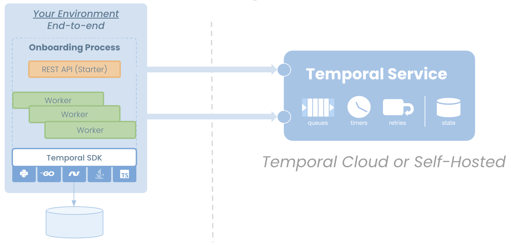

# Temporal Jump Start
## Curriculum

## Use Case Overview and Discussion
We will go over the Use Case your team sent to Temporal to ensure there is a common understanding of the domain and problem space including the following (15 mins):
1. Requirements and constraints including number of business processes
2. Upstream and downstream interactions and business ownership (as well as constraints like rate limiting)
3. Technical/Environmental issues (including firewalls, scalability, etc.)

*Outcomes:* The outcome of this section is a shared understanding of the customer use case. Any outstanding questions are answered during this discussion. If new questions arise, they are placed in a "parking lot" and assigned to someone to research. Just a note that some outstanding questions may impact design so they need to be taken into consideration during the rest of the session.

## Temporal Topology Review
This image shows a high-level overview of the Temporal system. Your application (consisting of your Workflows, Activities and Workers) will run on your chosen infrastructure (in one of the supported languages). Temporal currently offers SDK Clients for .NET, Java, Go, Python, Typescript and PHP with support for other languages on the roadmap. The application will connect to Temporal over mTLS using a private key for the CA certificate you configured in the Temporal Cloud UI previously. You may use an optional `Data Converter` to encrypt the payload that is sent to Temporal and you will own the keys for that.

###*Important Definitions:*### 
These are some important terms we will use throughout this class. For a full list of all Temporal terms, visit the [Temporal Glossary](https://docs.temporal.io/glossary)
*Workflow Definition:* The code that defines the workflow logic
*Workflow Execution:* A single instance of the Workflow Definition
*Workflow Task:* A task generated by Temporal to progress the Workflow Execution

*Outcomes:* Ensure the group has a shared understanding of the Temporal Operating Model and how that impacts design considerations.

## Top-Down Development Approach
Overview of Top-down development approach.
    We recommend a top-down development approach. This means starting with the overall objective of the solution and breaking the problem into smaller parts and solving them one at a time. This approach allows you to quickly get clarity on the greater system because you are identifying the subsystems involved upfront.

The **JumpStart** Code Project
Download the `jumpstart` project (https://github.com/temporalio/temporal-jumpstart-dotnet/).
This project is intended to introduce a Temporal application gradually using top-down application design. We can rename the components to match our Use Case identified in Section 1 to map Temporal thinking to our real-world requirements.

This is a .NET application which steps through an onboarding process.

