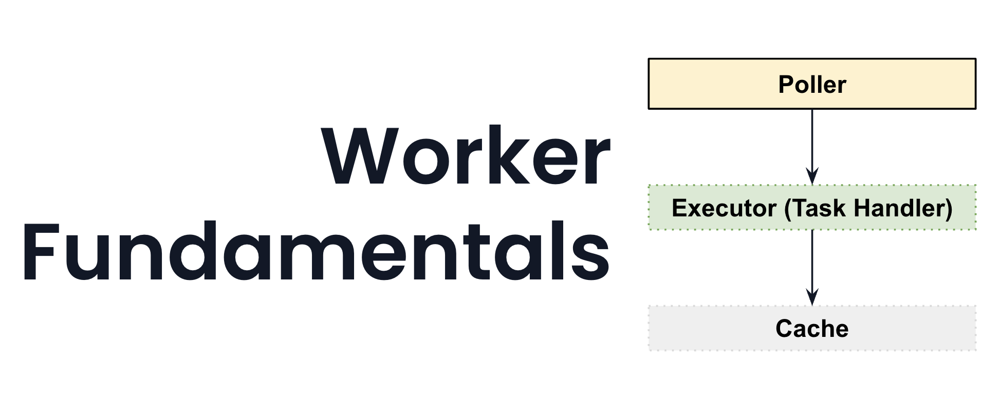

# Workers

## Goals

- Introduce the Temporal Worker
- Review Task Fundamentals
- Understand high level about Executors and Pollers to guide Worker configuration and deployment
- Run the Worker with our Workflow and Activity registered

## Task Fundamentals

## Worker Fundamentals

