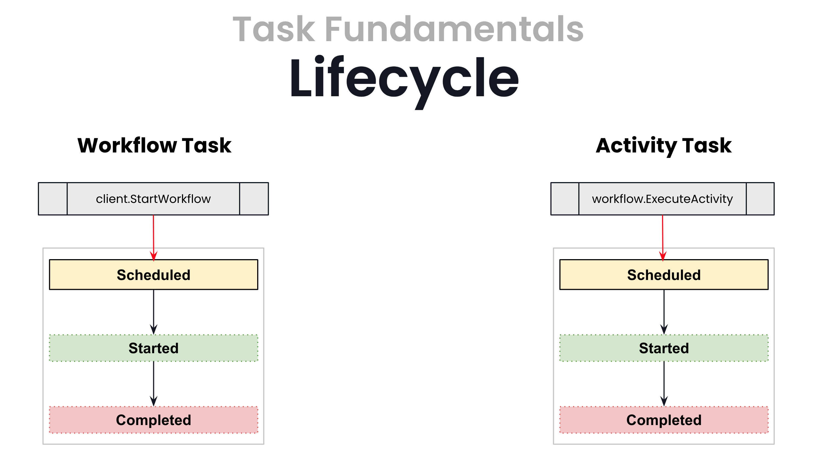

# Workers

## Goals

- Introduce the Temporal Worker 
- Review Task Fundamentals
- Understand high level about Executors and Pollers to guide Worker configuration and deployment
- Run the Worker with our Workflow and Activity registered 

## Task Fundamentals

## Worker Fundamentals

## Try It Out

Ensuring you are using either `cloud` or `local` launchSettings for both services:

1. Run the `Api` Program.
2. Run the `Domain` Program .
3. Visit the Swagger UI and
    1. `PUT` a `/onboardings/{id}` request.
        1. Note that if you include `timeout` text in the `value` you can simulate a Workflow failure when trying to "RegisterCrmEntity"
    2. `GET` a `/onboardings/{id}` request (using the ID you provided)
        1. See the response includes the Workflow Status
4. Visit the Temporal Web UI and verify that the Workflow has Completed or Failed as expected.